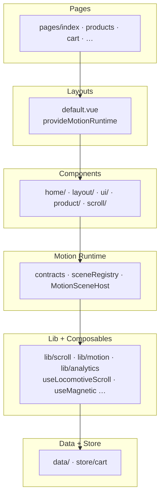
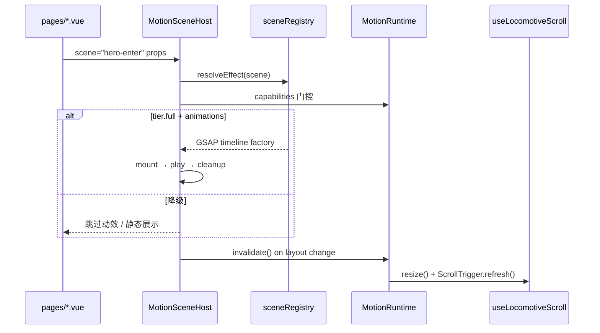
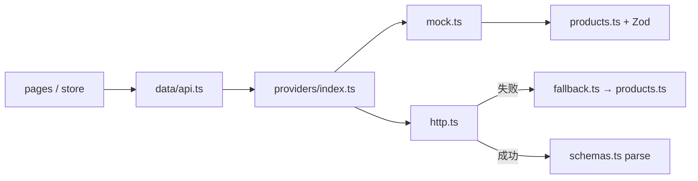

# 项目技术架构

| 字段     | 内容                                                                                                                      |
| -------- | ------------------------------------------------------------------------------------------------------------------------- |
| 适用范围 | 源码分层、Motion Runtime、模块索引                                                                                        |
| 关联文档 | [RESEARCH](./RESEARCH.md) · [COMPONENTS](./COMPONENTS.md) · [TRADEOFFS](./TRADEOFFS.md) · [PERFORMANCE](./PERFORMANCE.md) |
| 更新日期 | 2026-06-25                                                                                                                |

> 设计决策与取舍理由见 [TRADEOFFS](./TRADEOFFS.md)；动效原理见 [RESEARCH §2](./RESEARCH.md#2-核心原理)。

本页描述**源码如何分层组织**，以及 Motion Runtime 如何隔离滚动引擎与业务组件。组件 API 见 [COMPONENTS](./COMPONENTS.md)。

---

## 1. 六层架构



**依赖规则**：Pages → Components → Motion Runtime / Composables → Lib → Data/Store。禁止下层引用上层。

### Nuxt 4 目录约定

| 根目录           | 用途                                                                                             |
| ---------------- | ------------------------------------------------------------------------------------------------ |
| `app/`           | 应用源码（pages、components、composables、data、store…）                                         |
| `server/`        | Nitro API（如 `server/api/analytics.post.ts`）                                                   |
| `public/`        | 静态资源                                                                                         |
| `i18n/locales/`  | `@nuxtjs/i18n` 翻译 JSON（`nuxt.config.ts` 中 `langDir: 'locales'`，模块解析为 `i18n/locales/`） |
| `nuxt.config.ts` | 项目配置（无需自定义 `srcDir`）                                                                  |

`@/` 别名指向 `app/`。`npm install && npm run dev` 即可启动。

| 层                                    | 禁止                                                   |
| ------------------------------------- | ------------------------------------------------------ |
| `components/ui`                       | 直接 `inject(scrollInjectionKey)`、`import store/cart` |
| `components/product/ProductCardMedia` | 同上；通过 `emit('quick-add')` 上报                    |
| `components/scroll`                   | 直接 `new LocomotiveScroll`；消费 `MotionRuntime`      |
| `lib/scroll`                          | import Vue 组件或 pages                                |

---

## 2. 技术栈

| 类别     | 选型                                   | 理由                                                                                      |
| -------- | -------------------------------------- | ----------------------------------------------------------------------------------------- |
| 框架     | Vue 3 + Nuxt 4 + TS（SSR）             | SEO、文件路由、默认 `app/` 目录                                                           |
| 国际化   | `@nuxtjs/i18n` v10 + `vue-i18n` v11    | en / zh，`prefix_except_default`；物理路径 `i18n/locales/`（配置项 `langDir: 'locales'`） |
| 样式     | TailwindCSS 4                          | 设计 Token 集中管理                                                                       |
| 滚动     | Locomotive Scroll v5 + Lenis           | 对标 [Locomotive.ca](./RESEARCH.md)；**css-progress 优先**                                |
| 动画     | GSAP ScrollTrigger + `MotionSceneHost` | 声明式场景，页面不直接操作 DOM ref                                                        |
| 数据     | Zod + 静态 catalog                     | 运行时校验                                                                                |
| Commerce | `data/api.ts` + `data/providers/`      | mock/http 可切换                                                                          |
| 状态     | Pinia + localStorage                   | 购物车持久化                                                                              |
| 可观测   | web-vitals + transport 批量上报        | 全链路指标 + `/api/analytics`                                                             |
| 防御     | `error.vue` + jankGuard                | 全局兜底 + 自适应降帧                                                                     |
| 测试     | Vitest + CI typecheck + perf-budget    | 质量与包体积门禁                                                                          |

---

## 3. Motion Runtime

滚动与动效通过 `MotionRuntime` 接口对外暴露，由 `layouts/default.vue` 调用 `provideMotionRuntime()` 注入：

| API               | 说明                                      |
| ----------------- | ----------------------------------------- |
| `capabilities`    | 当前 `full \| reduced \| static` 能力快照 |
| `invalidate()`    | DOM 变更后通知 Locomotive resize          |
| `scrollTo()`      | 编程式滚动                                |
| `onProgress(cb)`  | 订阅 0–1 滚动进度（WebGL 等）             |
| `degrade(reason)` | 运行时降级（jank 超阈值触发）             |

页面级 GSAP 通过 `MotionSceneHost` + `sceneRegistry` 声明，不直接 import `animation.ts` 工厂。`scroll/` 内少数全局过渡（如 `PageIntroCurtain`）通过 `useGsapTimeline` 调用 `animation.ts` 工厂，仍不直接操作页面 DOM ref。

**首屏滚动**：`layouts/default.vue` 在 `onMounted` 始终调用 `init()`；Nuxt page transition 仅在客户端路由切换时触发 `onAfterEnter`，不能依赖其完成首次初始化。

**SSR 动效快照**：`SSR_MOTION_CAPABILITIES` 默认关闭 `webgl` / `parallax`，客户端 `onMounted` 后再升级为真实 tier，避免 WebGL canvas 水合闪烁。



**关键约束**（详见 [TRADEOFFS](./TRADEOFFS.md)）：

- GSAP ticker 统一驱动 Lenis（非双 RAF）
- `destroy()` 仅 revert 自有 `gsap.context()`，不 `ScrollTrigger.getAll().kill()`，避免误杀组件内 trigger
- 首页 `components/home/*` 区块化；微交互仅导航 / CTA / 商品卡点缀
- `jankGuard`：10s 窗口内 >5% 帧超 32ms → `degrade('jank')`
- WebGL 仅 `tier.full`；`prefers-reduced-motion` 下 Marquee 静止

---

## 4. 核心模块

| 模块              | 路径                                                          |
| ----------------- | ------------------------------------------------------------- |
| Motion 契约       | `app/lib/motion/contracts.ts`                                 |
| 场景注册表        | `app/lib/motion/sceneRegistry.ts`                             |
| WebGL 公共层      | `app/lib/motion/webglCanvas.ts` · `webglShaders.ts`           |
| Jank 自适应降级   | `app/lib/motion/jankGuard.ts`                                 |
| MotionRuntime     | `app/composables/useMotionRuntime.ts`                         |
| 布局失效通知      | `app/composables/useLayoutInvalidation.ts`                    |
| Locomotive 封装   | `app/composables/useLocomotiveScroll.ts`                      |
| Commerce 错误 key | `app/data/errors.ts` · `lib/i18n/translateError.ts`           |
| 磁性 / 视差       | `useMagnetic.ts` · `useMouseParallax.ts`                      |
| 加购编排          | `useProductQuickAdd.ts`                                       |
| 微交互组件        | `HoverShuffleText.vue` · `MagneticButton.vue`                 |
| 声明式场景        | `MotionSceneHost.vue`                                         |
| 首页区块          | `components/home/*`                                           |
| GSAP 工厂         | `lib/scroll/animation.ts`                                     |
| Analytics         | `lib/analytics/transport.ts` + `server/api/analytics.post.ts` |
| 全局错误页        | `error.vue`                                                   |
| 性能预算          | `scripts/perf-budget.mjs`                                     |

组件用法见 [COMPONENTS.md](./COMPONENTS.md)。

---

## 5. Commerce 数据层

电商数据通过 **Provider 模式** 隔离，Page / Store 只调用 facade，不直连 HTTP 或静态目录。



### 分层职责

| 模块          | 路径                          | 职责                                                      |
| ------------- | ----------------------------- | --------------------------------------------------------- |
| Facade        | `app/data/api.ts`             | `fetchProducts` / `fetchProductBySlug` / `submitCheckout` |
| Provider 注册 | `app/data/providers/index.ts` | 按 `NUXT_PUBLIC_COMMERCE_PROVIDER` 选择实现               |
| Mock          | `app/data/providers/mock.ts`  | 读取本地 `products.ts`，模拟延迟                          |
| HTTP          | `app/data/providers/http.ts`  | REST 请求 + Zod 校验 + timeout                            |
| Fallback      | `app/data/fallback.ts`        | API 失败时回退本地目录                                    |
| 领域类型      | `app/data/schemas.ts`         | Zod Schema → `z.infer` 推导 `Product` 等类型              |
| 静态目录      | `app/data/products.ts`        | 10 SPU 源数据 + 多语言覆盖                                |
| 配置          | `app/data/config.ts`          | 集中读取 `NUXT_PUBLIC_*` 环境变量                         |

### 统一响应格式

```ts
interface CommerceResponse<T> {
  data: T | null
  error: string | null // i18n key（如 fallback.offlineCatalog），Page 层用 te() + t() 翻译
  meta?: { latencyMs: number; source: 'api' | 'cache' | 'fallback' }
}
```

错误 key 集中在 `app/data/errors.ts`（`COMMERCE_ERROR_KEYS`）；HTTP provider 与 checkout 页面通过 `translateErrorKey()` 映射用户可见文案。切换 locale 时 `useLocale().switchLocale()` 会 `clearCache()` 避免陈旧 catalog 缓存。

### REST 约定（http 模式）

| 方法 | 路径              | 响应                  |
| ---- | ----------------- | --------------------- |
| GET  | `/products`       | `Product[]`           |
| GET  | `/products/:slug` | `Product`             |
| POST | `/checkout`       | `{ orderId: string }` |

切换方式：

```bash
NUXT_PUBLIC_COMMERCE_PROVIDER=http
NUXT_PUBLIC_API_BASE_URL=https://api.example.com
```

新增 Provider：实现 `CommerceProvider` 接口 → 在 `providers/index.ts` 注册。测试时用 `resetCommerceProvider()` 清除缓存。

购物车状态独立于 Commerce 层，由 `app/store/cart.ts`（Pinia + `localStorage`）管理。

---

## 6. 扩展路径

| 任务           | 做法                                                                                                        |
| -------------- | ----------------------------------------------------------------------------------------------------------- |
| 新增页面       | `app/pages/<route>.vue`（文件路由自动注册）                                                                 |
| 新增动效场景   | `sceneRegistry.ts` 注册 effect → 页面用 `MotionSceneHost`                                                   |
| 新增微交互     | 复用 `HoverShuffleText` / `MagneticButton` / `useMouseParallax`；参数见 [VISUAL-DESIGN](./VISUAL-DESIGN.md) |
| 新增 SPU       | `app/data/products.ts` + 更新 `scripts/generate-seo.mjs` slugs                                              |
| 新增翻译       | `i18n/locales/<locale>.json`（`nuxt.config.ts` → `i18n.langDir: 'locales'`）                                |
| 接真实 Catalog | `NUXT_PUBLIC_COMMERCE_PROVIDER=http` + `NUXT_PUBLIC_API_BASE_URL`                                           |
| 生产 analytics | `NUXT_PUBLIC_ENABLE_ANALYTICS=true`，transport POST `/api/analytics`                                        |

---

## 下一步阅读

- 组件 API 与 data-scroll 约定 → [COMPONENTS](./COMPONENTS.md)
- 动效原理与选型决策树 → [RESEARCH §3.3](./RESEARCH.md#33-动效选型决策树)
- 常见问题排错 → [FAQ](./FAQ.md)
