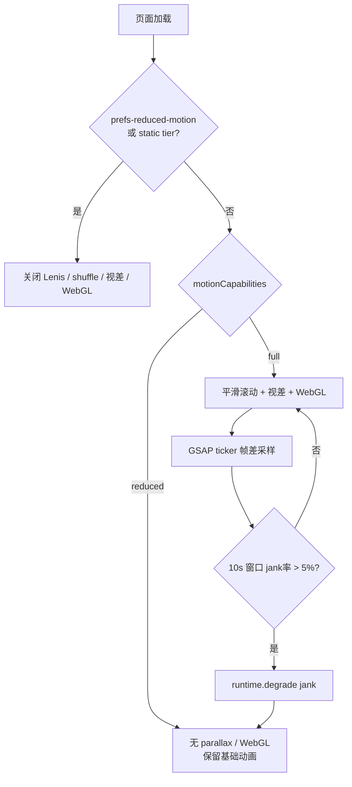
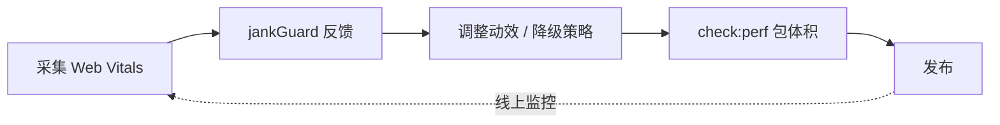

# 性能监控与迭代优化

| 字段     | 内容                                                                                                  |
| -------- | ----------------------------------------------------------------------------------------------------- |
| 适用范围 | Web Vitals、动效降级、包体积预算、线上运维                                                            |
| 关联文档 | [TRADEOFFS](./TRADEOFFS.md) · [VISUAL-DESIGN](./VISUAL-DESIGN.md) · [ARCHITECTURE](./ARCHITECTURE.md) |
| 更新日期 | 2026-06-25                                                                                            |

> 动效选型与性能权衡见 [TRADEOFFS §维度一](./TRADEOFFS.md#维度一视觉动效-vs-性能)；微交互参数见 [VISUAL-DESIGN](./VISUAL-DESIGN.md)。

本页覆盖**如何度量、如何降级、如何调优**：从 Web Vitals 埋点到 jankGuard 运行时反馈，再到 CI 包体积预算。

---

## 1. 量化指标

| 指标              | 目标           | 告警    | 门禁                 |
| ----------------- | -------------- | ------- | -------------------- |
| LCP               | < 2.5s         | > 4.0s  | `web_vital` 埋点     |
| CLS               | < 0.1          | > 0.25  | `web_vital` 埋点     |
| INP               | < 200ms        | > 500ms | `web_vital` 埋点     |
| Motion Jank       | < 5% 帧 > 32ms | > 10%   | `jankGuard` 自动降级 |
| scroll chunk gzip | < 200KB        | > 200KB | `npm run check:perf` |
| vendor chunk gzip | < 280KB        | > 280KB | `npm run check:perf` |

---

## 2. 埋点体系

### Web Vitals

`app/lib/analytics/webVitals.ts` 采集 LCP、CLS、INP、FCP、TTFB，通过 `track()` 上报。

### 业务与动效事件

| 事件             | 触发点                       |
| ---------------- | ---------------------------- |
| `page_view`      | 路由切换                     |
| `funnel_step`    | 转化漏斗各阶段               |
| `product_view`   | PDP 挂载                     |
| `add_to_cart`    | 加购成功                     |
| `begin_checkout` | 进入结算                     |
| `purchase`       | 订单成功                     |
| `motion_jank`    | GSAP ticker 帧差超阈值       |
| `motion_skipped` | 场景因能力门控跳过           |
| `web_vital`      | LCP / CLS / INP 等           |
| `app_error`      | 全局未捕获错误 / `error.vue` |

### Transport 批量上报

`app/lib/analytics/transport.ts`：

- `NUXT_PUBLIC_ENABLE_ANALYTICS=true` 时批量 POST `/api/analytics`
- 20 条一批或 5s 定时 flush；`pagehide` 时 `keepalive` 冲刷剩余队列
- 服务端：`server/api/analytics.post.ts`（Zod 校验 + IP 限流；桶数 > 500 时清理过期条目）
- 开发环境：`console.debug('[analytics]', ...)`

---

## 3. 降级策略

`app/lib/motion/motionCapabilities.ts` → `getMotionCapabilitiesSnapshot()`

| Tier    | smoothScroll | parallax | webgl | animations |
| ------- | ------------ | -------- | ----- | ---------- |
| full    | ✅           | ✅       | ✅    | ✅         |
| reduced | 条件         | ❌       | ❌    | ✅         |
| static  | ❌           | ❌       | ❌    | ❌         |

**SSR / 首屏**：`SSR_MOTION_CAPABILITIES` 与客户端首次 paint 对齐为保守值（`webgl: false`），`useMotionCapabilities` 在 `onMounted` 后刷新为真实 tier。



**静态触发**（页面加载时判定）：

- `prefers-reduced-motion: reduce` → static
- cores ≤ 2 或 memory ≤ 2 或 2g 网络 → reduced
- 移动端 → parallax / webgl off；`useMouseParallax` 不挂载

**运行时触发**（`jankGuard`）：

- 10s 滑动窗口内 jank 率 > 5% 且 tier 为 `full`
- 调用 `runtime.degrade('jank')` → `forceMotionDegrade`
- 关闭平滑滚动 / WebGL，保留基础 CSS 动效
- 降级后需整页刷新恢复；测试可用 `resetMotionDegradeState()` 重置

微交互降级矩阵见 [VISUAL-DESIGN §降级](./VISUAL-DESIGN.md#降级矩阵)。

---

## 4. 调优清单

1. **优先 css-progress** — Hero、Dynasty、scrub（见 [RESEARCH](./RESEARCH.md)）
2. **声明式场景** — `MotionSceneHost` 替代 Page 级 DOM ref
3. **微交互门控** — 检查 `capabilities.animations` 与 `(hover: hover)`
4. **LazyImage** — `useLayoutInvalidation` 替代 scroll inject
5. **WebGL** — `lib/motion/webglCanvas.ts` 统一 shader / 纹理 / ticker；InView 挂载；离屏暂停
6. **路由切换** — `layouts/default.vue` 在 page transition 路径 destroy + `onAfterEnter` 重 init；`destroy()` 不全局 kill ScrollTrigger
7. **代码分包** — scroll 库独立 chunk（`nuxt.config.ts`）

---

## 5. CI 性能预算

```bash
npm run build
npm run check:perf
```

`scripts/perf-budget.mjs` 检查 `.output/public/_nuxt/*.js` gzip 体积。

---

## 6. 迭代闭环



### 常见问题

| 现象              | 排查                       | 方案                                                                |
| ----------------- | -------------------------- | ------------------------------------------------------------------- |
| 首屏无平滑滚动    | 直链进入 + page transition | `default.vue` 已在 `onMounted` 强制 init；确认 `scroll-ready` class |
| 首页掉帧          | `motion_jank`              | jankGuard 自动降级；减少 WebGL                                      |
| LCP 慢            | Network 面板               | 首屏图 eager + preload                                              |
| CLS 高            | Layout Shift               | 固定 aspect-ratio                                                   |
| 埋点丢失          | transport                  | 确认 `ENABLE_ANALYTICS=true`                                        |
| 商品卡 hover 掉帧 | 列表页 + jank              | 视差减半或 `ENABLE_PARALLAX=false`                                  |
| shuffle 干扰阅读  | 全站滥用                   | 仅导航 / 关键 CTA                                                   |

---

## 7. 线上运维

- CI：`lint → typecheck → test → build:e2e → Playwright`
- 动态关闭动画：`NUXT_PUBLIC_ENABLE_SMOOTH_SCROLL=false`
- Analytics：`NUXT_PUBLIC_ENABLE_ANALYTICS=true`
- 部署与环境变量详见 [DEPLOYMENT](./DEPLOYMENT.md)

---

## 下一步阅读

- 动效取舍与量化约束 → [TRADEOFFS §维度一](./TRADEOFFS.md#维度一视觉动效-vs-性能)
- 微交互降级矩阵 → [VISUAL-DESIGN §五](./VISUAL-DESIGN.md#五商品卡规范)
- 本地开发与 CI 门禁 → [DEPLOYMENT](./DEPLOYMENT.md)
