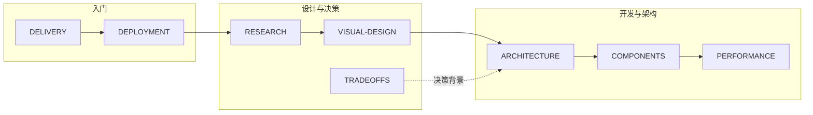

# 文档中心

Atelier Furniture 的技术文档与源码同步维护。本页是文档站的**阅读入口**；仓库根目录 `README.md` 面向 GitHub 访客，提供项目概览与快速上手。

## 快速开始

```bash
npm install
npm run dev          # 主站 http://localhost:3000
npm run docs:dev     # 文档站 http://localhost:5173
```

| 站点 | 地址                                         |
| ---- | -------------------------------------------- |
| 主站 | https://locomotive-furniture.vercel.app      |
| 文档 | https://locomotive-furniture-docs.vercel.app |

站点元数据见 [`sites.json`](../sites.json)。环境配置与部署流程见 [DEPLOYMENT](./DEPLOYMENT.md)。

---

## 按角色阅读

各文档通过交叉引用串联，**无需线性通读**。按你的角色选择起点即可。



| 角色            | 建议路径                                                                                                        |
| --------------- | --------------------------------------------------------------------------------------------------------------- |
| **评审 / 产品** | [DELIVERY](./DELIVERY.md) → [RESEARCH](./RESEARCH.md) → [TRADEOFFS](./TRADEOFFS.md)                             |
| **前端开发**    | [ARCHITECTURE](./ARCHITECTURE.md) → [COMPONENTS](./COMPONENTS.md) → [VISUAL-DESIGN](./VISUAL-DESIGN.md)         |
| **动效调优**    | [RESEARCH §2](./RESEARCH.md#2-核心原理) → [VISUAL-DESIGN](./VISUAL-DESIGN.md) → [PERFORMANCE](./PERFORMANCE.md) |
| **运维 / CI**   | [DEPLOYMENT](./DEPLOYMENT.md) → [FAQ](./FAQ.md) → [CONTRIBUTING](./CONTRIBUTING.md)                             |

---

## 文档索引

| 文档                                | 定位                                                    |
| ----------------------------------- | ------------------------------------------------------- |
| [DELIVERY](./DELIVERY.md)           | Demo 范围、产物清单、在线地址                           |
| [RESEARCH](./RESEARCH.md)           | Locomotive.ca 调研：Lenis / css-progress 原理与复刻映射 |
| [VISUAL-DESIGN](./VISUAL-DESIGN.md) | 排版阶梯、色彩 scrub、微交互参数与验收                  |
| [TRADEOFFS](./TRADEOFFS.md)         | 动效 / 性能 / 电商 / 工程化决策矩阵                     |
| [ARCHITECTURE](./ARCHITECTURE.md)   | 六层架构、Motion Runtime、模块索引                      |
| [COMPONENTS](./COMPONENTS.md)       | 组件 API、composables、data-scroll 约定                 |
| [PERFORMANCE](./PERFORMANCE.md)     | Web Vitals、降级策略、perf-budget                       |
| [DEPLOYMENT](./DEPLOYMENT.md)       | 本地开发、Vercel 双项目、E2E、环境变量                  |
| [FAQ](./FAQ.md)                     | 动效、i18n、Commerce、CI 常见问题                       |
| [CONTRIBUTING](./CONTRIBUTING.md)   | GitHub Flow、代码门禁、文档同步约定                     |

---

## 常用命令

| 命令                    | 说明                              |
| ----------------------- | --------------------------------- |
| `npm run dev`           | 开发主站                          |
| `npm run docs:dev`      | 开发文档站（含 Mermaid 图表渲染） |
| `npm run check`         | lint + typecheck + test（全量）   |
| `npm run check:changed` | 增量检查（pre-push hook 默认）    |
| `npm run check:perf`    | 构建后包体积预算                  |
| `npm run build`         | 构建主站                          |
| `npm run docs:build`    | 构建文档站                        |
| `npm run deploy:all`    | 手动部署主站 + 文档               |
