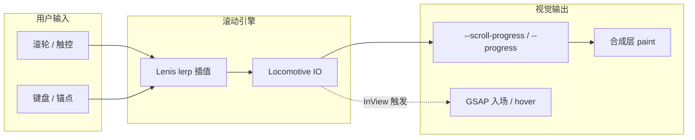
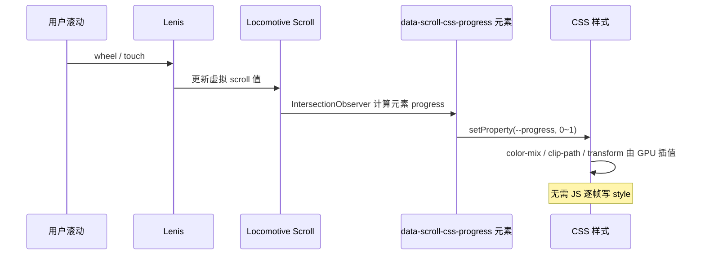
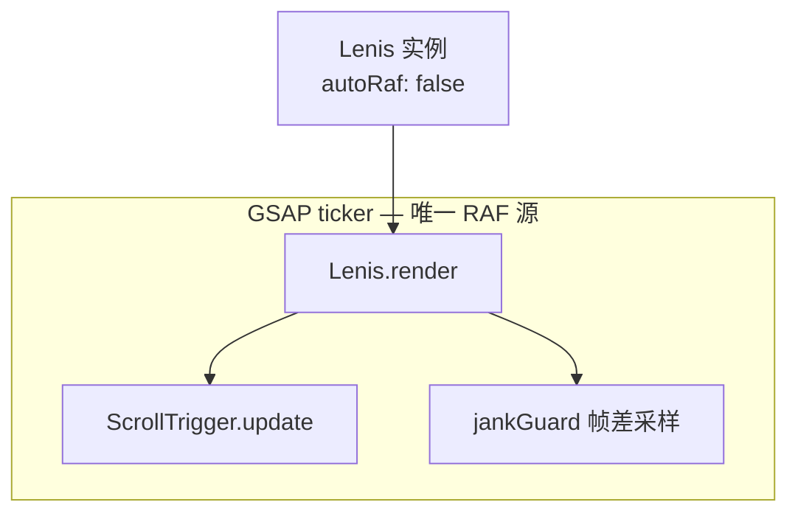
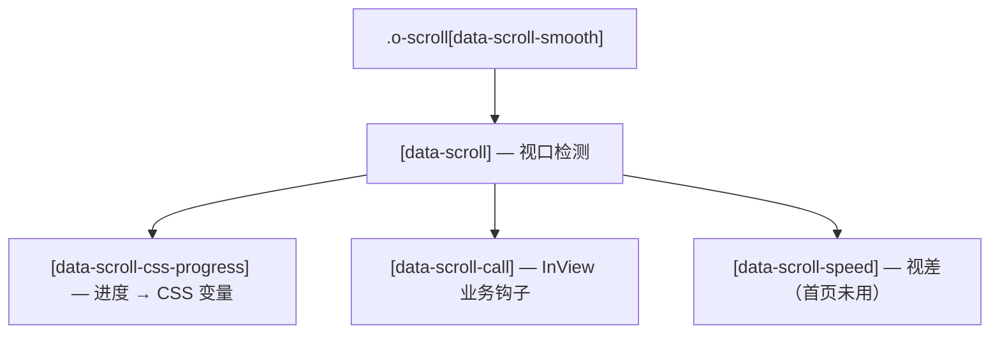
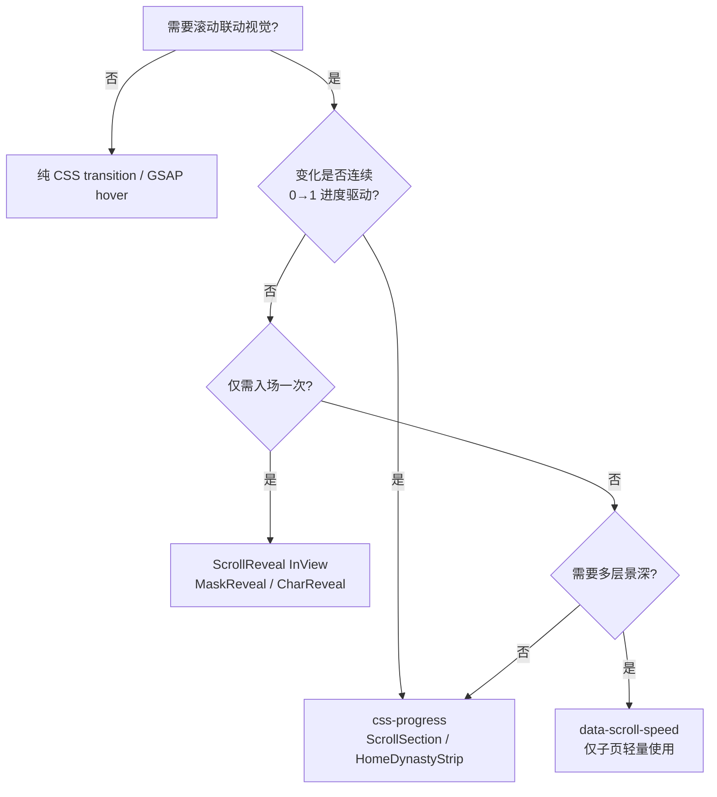
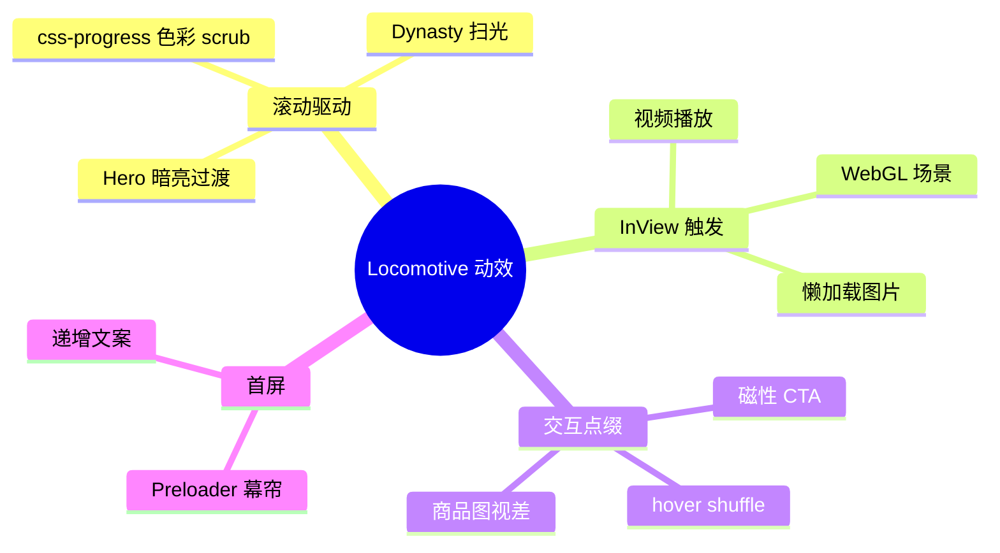
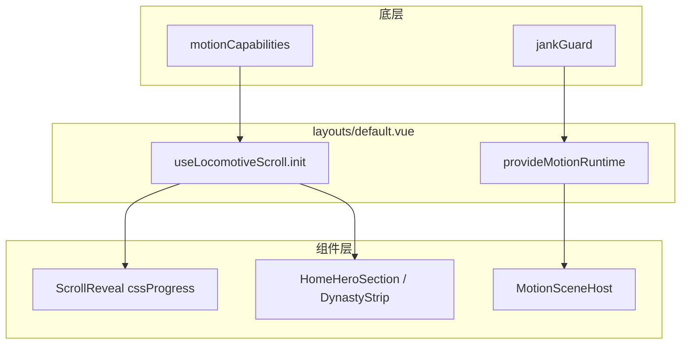

# Locomotive.ca 滚动视觉调研报告

| 字段     | 内容                                                                                                                                              |
| -------- | ------------------------------------------------------------------------------------------------------------------------------------------------- |
| 参考站点 | https://locomotive.ca/en                                                                                                                          |
| 调研方法 | SSR HTML DOM 抓取 + `app.js` 静态分析                                                                                                             |
| 调研日期 | 2026-06-25                                                                                                                                        |
| 关联文档 | [ARCHITECTURE.md](./ARCHITECTURE.md) · [VISUAL-DESIGN.md](./VISUAL-DESIGN.md) · [COMPONENTS.md](./COMPONENTS.md) · [TRADEOFFS.md](./TRADEOFFS.md) |

[[toc]]

---

## 1. 摘要

Locomotive.ca 首页的滚动体验由 **Lenis 平滑插值** 与 **CSS 滚动进度变量** 共同构成，而非原生 `scroll-behavior` 或多层 `data-scroll-speed` 视差。动效以滚动进度为主线，GSAP 仅作入场与交互点缀。

本项目通过对标上述机制，在 `useLocomotiveScroll` 之上以组件化方式复刻核心视觉；商品页保持轻量动效，算力集中于首页长页叙事。



---

## 2. 核心原理

本节从机制层面解释原站「丝滑感」的来源，以及本项目复刻时的技术选型依据。

### 2.1 Lenis 虚拟滚动与 lerp 插值

原生 `scroll-behavior: smooth` 在每次滚动事件时直接修改 `scrollTop`，曲线固定且与帧率无关，快速滚轮时易出现「阶梯感」。

Lenis 采用 **指数衰减追赶（lerp）** 模型：每一帧将当前滚动位置向目标位置靠近一小步，而非一步到位。

```
current += (target - current) × lerp     // 典型 lerp = 0.1 ~ 0.12
```

| 概念                 | 说明                                      |
| -------------------- | ----------------------------------------- |
| **目标位置 target**  | 滚轮累积量映射的「理想」滚动终点          |
| **当前位置 current** | Lenis 内部维护的虚拟滚动值                |
| **lerp 系数**        | 越小越「重」、惯性越长；原站约 `0.1–0.12` |
| **wheelMultiplier**  | 降低单次滚轮灵敏度，避免滑过头            |

感知效果：输入停止后，页面仍缓慢减速到位——类似物理惯性，而非 CSS smooth 的固定时长缓动。

> 本项目常量见 `app/lib/scroll/scrollConstants.ts`：`lerp: 0.12`、`wheelMultiplier: 0.9`。滚轮场景 **不设 duration**，避免与 lerp 冲突产生「顿挫」。

### 2.2 css-progress：进度注入 CSS 变量

原站大量区块使用 `data-scroll-css-progress`，由 Locomotive 在元素进出视口时计算 **元素局部进度** `0 → 1`，写入 `--scroll-progress`（元素级）或根级 `--scroll-progress`（全局）。

**原理链路**：



与 `data-scroll-speed` 视差的对比：

| 维度     | css-progress                          | data-scroll-speed 视差           |
| -------- | ------------------------------------- | -------------------------------- |
| 驱动量   | 元素在视口中的 **归一化进度**         | 滚动位移 × speed 系数            |
| 样式载体 | CSS 自定义属性 + `calc` / `color-mix` | 每层独立 `transform: translateY` |
| 合成层   | 通常 1 层，属性动画可走 compositor    | 多层 transform 叠加，易触发重绘  |
| 语义     | 适合色彩渐变、扫光、区块叙事          | 适合简单景深错位                 |
| 原站首页 | ✅ 主力                               | ❌ 未使用                        |

**关键结论**：首页视觉变化主要由 **CSS 自定义属性** 承载，在性能与稳定性上优于多层 speed 视差，应作为本项目首页叙事的首选模式。

### 2.3 单 RAF 循环：GSAP ticker × Lenis

若 Lenis 与 GSAP 各自注册 `requestAnimationFrame`，同一帧可能执行两次布局读取，引发 **forced reflow** 与帧率抖动。

原站与本项目的标准做法：



对应实现（`useLocomotiveScroll.ts`）：

- `initCustomTicker: (render) => gsap.ticker.add(render)` — Lenis 渲染挂入 GSAP
- `ScrollTrigger.scrollerProxy(document.documentElement, …)` — 让 ScrollTrigger 读取 Lenis 的 `scroll` 值
- `lenis.on('scroll', ScrollTrigger.update)` — 滚动时刷新 ST 计算

这样 ScrollTrigger 与 Lenis 共享同一帧时钟，避免双循环竞争。

### 2.4 InView 与延迟挂载（data-scroll-call）

重资源（背景视频、Three.js 场景）不在首屏立即初始化，而是等元素进入视口后再挂载——对齐原站 `data-scroll-call="inview, HomeHero"` 模式。

| 策略                              | 收益                               |
| --------------------------------- | ---------------------------------- |
| 视频 `play()` 延迟到 InView       | 减少首屏解码与带宽竞争             |
| WebGL `TeamScene3D` InView 初始化 | 避免离屏 WebGL context 占用 GPU    |
| `LazyImage` rootMargin `15%`      | 距视口 15% 预加载，平衡 LCP 与 CLS |

### 2.5 Preloader 与滚动门禁

原站 Preloader 在资源就绪前锁定 `body` overflow，防止用户在布局未稳定时滚动导致 **进度变量跳变** 与 CLS。本项目 `PageIntroCurtain` 对标此行为；`prefers-reduced-motion` 下跳过锁屏。

---

## 3. 滚动架构

### 3.1 容器层级



ASCII 对照：

```
.o-scroll[data-scroll-smooth="true"]     ← 滚动根（Lenis 实例挂载点）
└── [data-scroll]                         ← 视口检测
    └── [data-scroll-css-progress]        ← 进度注入 CSS 变量
```

### 3.2 机制速查

与 §2 原理对应的 Locomotive 声明式 API：

| 能力     | 原站实现                             | 作用                         |
| -------- | ------------------------------------ | ---------------------------- |
| 平滑滚动 | Lenis 虚拟插值                       | 惯性缓动；原生滚动条仍同步   |
| 进度驱动 | `data-scroll-css-progress`           | 元素随滚动渐变，减少逐帧 JS  |
| 视口检测 | `data-scroll` + `data-scroll-repeat` | 元素进出视口时重复触发       |
| 业务钩子 | `data-scroll-call`                   | 视口内才播放视频 / 初始化 3D |
| 首屏门禁 | Preloader 锁定 `body`                | 避免未就绪时滚动             |

### 3.3 动效选型决策树

新增区块动效时，可沿此路径选型：



---

## 4. 视觉动效体系

动效遵循统一原则：**滚动进度驱动区块变化，而非独立并发动画堆叠。**



| 页面区块      | 视觉效果                         | 触发条件                          |
| ------------- | -------------------------------- | --------------------------------- |
| Preloader     | 品牌文案逐级递增                 | 固定时长 Promise                  |
| Hero          | 全屏背景视频 + 标题入场          | `css-progress`；InView 后播放视频 |
| Summary       | 环形进度图形（Dynasty）          | `data-scroll-module-progress`     |
| Featured Work | 作品卡片网格；hover 字符打散     | `data-hover-shuffle`；图片懒加载  |
| About         | 长文案 + 3D 团队场景             | 进入视口后初始化 Three.js         |
| 全局交互      | 链接 / 按钮 hover 字符跳动       | GSAP shuffle                      |
| 磁性 CTA      | 按钮向光标吸附、离开回弹         | pointer lerp + `expo.out`         |
| 商品 / 作品卡 | 图片 hover 微位移 + 副图交叉淡入 | 鼠标视差 + opacity transition     |
| 媒体          | SVG 占位 → 真实图渐进替换        | 距视口 15% 触发 `lazyLoad`        |

---

## 5. 复刻策略

### 5.1 滚动层映射

| 原站                       | 本项目                                                    | 说明                            |
| -------------------------- | --------------------------------------------------------- | ------------------------------- |
| `.o-scroll` + Lenis        | `composables/useLocomotiveScroll.ts`                      | Locomotive Scroll v5 内置 Lenis |
| `data-scroll-css-progress` | `ScrollReveal` · `HomeDynastyStrip` · `HomeAgencySection` | 绑定 `--progress`               |
| SPA 路由切换               | `onUnmounted` → `destroy()`                               | 防止实例泄漏                    |
| 设备分级                   | `lib/motion/motionCapabilities.ts`                        | 关闭平滑滚动 / 视差             |

根布局初始化滚动实例，页面通过 `data-scroll` 属性或封装组件消费：

```ts
// layouts/default.vue
useLocomotiveScroll({ enableSmooth: true, enableParallax: true })
```

**本项目数据流**：



### 5.2 视觉层映射

| 原站区块           | 本项目组件                                     | 实现要点                               |
| ------------------ | ---------------------------------------------- | -------------------------------------- |
| Preloader 循环文案 | `PageIntroCurtain` · `CyclingText`             | 首屏幕帘 + 递增文案                    |
| Hero 进度叙事      | `HomeHeroSection`                              | `MotionSceneHost` + css-progress       |
| Dynasty 扫光       | `HomeDynastyStrip`                             | `text-scrub-fill` + `HoverShuffleText` |
| 作品精选           | `HomeFeaturedRail` · `HomeFeaturedWorkItem`    | 响应式网格；暗场展示 + `ImageTilt3D`   |
| 文字入场           | `CharReveal` · `SplitText` · `MotionSceneHost` | GSAP 声明式场景                        |
| 循环字幕           | `MarqueeBand` · `CyclingText`                  | 对标 hover shuffle 节奏                |
| hover 字符跳动     | `HoverShuffleText` · `createHoverShuffle`      | 导航链接；`AppHeader`                  |
| 磁性 CTA           | `MagneticButton` · `useMagnetic`               | `/about` 页底部 CTA                    |
| 商品图视差         | `useMouseParallax` · `ProductCardMedia`        | Grid ±10px / Rail ±8px                 |
| 图片揭示           | `MaskReveal` · `LazyImage`                     | 占位 + 懒加载；`useLayoutInvalidation` |
| 商品展示           | `ProductCard` · `ProductCardMedia`             | emit 解耦 + `useProductQuickAdd`       |

### 5.3 实施阶段

| 阶段 | 范围                                                   | 状态                                  |
| ---- | ------------------------------------------------------ | ------------------------------------- |
| P0   | 滚动底座 + 首页 css-progress（Hero / Dynasty / scrub） | ✅ 已落地                             |
| P1   | 精选网格、开场幕帘递增文案、InView 懒加载              | ✅ 已落地                             |
| P2   | Motion Runtime 分层 + 声明式场景 + 可观测闭环          | ✅ 已落地                             |
| P3   | 导航 hover shuffle、磁性 CTA、商品视差                 | ✅ 已落地                             |
| P4   | 全站链接 shuffle、首页团队 3D 区块                     | 可选（`/about` 已集成 `TeamScene3D`） |

### 5.4 性能约束

原站未显式分级降级；本项目须补齐以下红线（详见 [TRADEOFFS.md](./TRADEOFFS.md) · [PERFORMANCE.md](./PERFORMANCE.md)）：

| 条件                     | 策略                                            |
| ------------------------ | ----------------------------------------------- |
| 视口 `< 768px`           | 关闭视差；保留基础平滑或退回原生滚动            |
| `prefers-reduced-motion` | 跳过 preloader 锁屏与 scrub 动画                |
| 视频 / WebGL             | InView 后才挂载（对齐 `data-scroll-call` 模式） |
| 路由离开                 | 销毁 Scroll + GSAP 实例                         |
| 运行时 jank              | `jankGuard` 自动降级                            |
| 全局异常                 | `error.vue` + `app_error` 埋点                  |

---

## 6. 结论

Locomotive.ca 的「丝滑感」来源于 **Lenis 平滑底座 + CSS 进度驱动 + 少量 GSAP 交互**，而非视差层堆叠。其工程本质可归纳为：

1. **一帧一路径** — GSAP ticker 统一驱动 Lenis 与 ScrollTrigger
2. **进度即样式** — css-progress 把滚动叙事交给 CSS compositor
3. **重资源晚挂载** — InView 门控视频 / WebGL / 大图
4. **交互与滚动分离** — hover shuffle / 磁性用独立小 lerp，不与滚轮 lerp 混用

本项目复刻路径：以 `useLocomotiveScroll` 对齐滚动机制，以现有 `scroll/` 组件按区块映射视觉语言；采用 **「首页沉浸式长页 + 商品页轻动效」** 策略，在品牌质感与电商转化之间取得平衡。

**美学与微交互细则**见 [VISUAL-DESIGN.md](./VISUAL-DESIGN.md)（排版阶梯、磁性按钮、hover shuffle、商品视差参数）。

---

## 下一步阅读

- 视觉规范与微交互参数 → [VISUAL-DESIGN](./VISUAL-DESIGN.md)
- 六层架构与 Motion Runtime → [ARCHITECTURE](./ARCHITECTURE.md)
- 已做决策与量化约束 → [TRADEOFFS](./TRADEOFFS.md)
