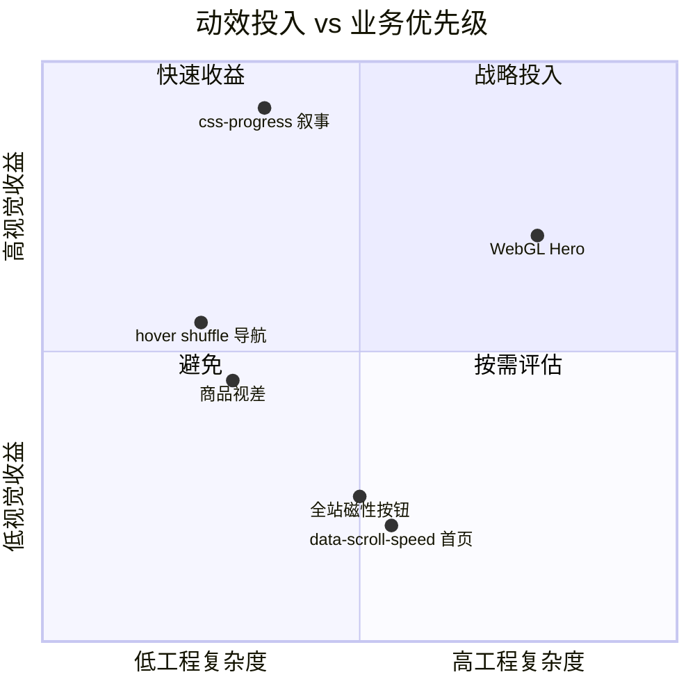

# 全项目取舍权衡

| 字段     | 内容                                                                                                                                  |
| -------- | ------------------------------------------------------------------------------------------------------------------------------------- |
| 适用范围 | 动效、滚动、电商、可观测性、架构分层决策                                                                                              |
| 关联文档 | [RESEARCH](./RESEARCH.md) · [ARCHITECTURE](./ARCHITECTURE.md) · [VISUAL-DESIGN](./VISUAL-DESIGN.md) · [PERFORMANCE](./PERFORMANCE.md) |
| 更新日期 | 2026-06-25                                                                                                                            |

> 本页记录**已做出的选择**及理由。技术实现见 [ARCHITECTURE](./ARCHITECTURE.md)；美学参数见 [VISUAL-DESIGN](./VISUAL-DESIGN.md)。

阅读本页可快速了解「为什么这样设计」，而非「怎么实现」。实现细节请跳转对应专题文档。

**核心原则**：Motion Runtime 协议驱动分层；首页区块组件化；微交互按需点缀；交易链路简洁；可观测与防御式降级闭环。

---

## 维度一：视觉动效 vs 性能

| 选项                          | 选择    | 理由                                                       |
| ----------------------------- | ------- | ---------------------------------------------------------- |
| 全站 Locomotive 滚动实例      | ✅      | 所有路由 init + ScrollReveal InView                        |
| 首页 css-progress 叙事        | ✅      | Hero / Dynasty；对标原站实测                               |
| `data-scroll-speed` 视差      | ❌ 首页 | 原站首页无 speed；避免多层 transform 掉帧                  |
| GSAP 复杂时间轴               | ✅      | Hero + Dynasty + 遮罩行；不用 ST pin（与 Locomotive 冲突） |
| 逐行遮罩 / Marquee / 循环文案 | ✅      | `PageIntroCurtain` + `CyclingText`；Marquee 纯 CSS         |
| ScrollReveal clip/scale       | ✅      | CSS transition 揭示，无额外 GSAP                           |
| GSAP ticker 驱动 Lenis        | ✅      | 单 RAF，与 ScrollTrigger 帧同步                            |
| WebGL Hero                    | ✅ 条件 | `capabilities.webgl` 门控                                  |
| 商品卡双图 + 视差             | ✅      | `useMouseParallax`；`hover: hover` 门控                    |
| 导航 hover shuffle            | ✅      | 仅桌面导航，非全站                                         |
| 磁性 CTA                      | ✅      | About 页；`strength: 0.28`                                 |
| 原生滚动降级                  | ✅      | `prefers-reduced-motion` + 低端设备                        |

**量化约束**：LCP < 2.5s · CLS < 0.1 · motion jank < 5% 帧 > 32ms

---

## 维度二：滚动体验 vs 工程复杂度

| 选项                 | 选择 | 理由                                           |
| -------------------- | ---- | ---------------------------------------------- |
| Locomotive v5        | ✅   | 声明式 `data-scroll-*`，对标原站               |
| 纯 Lenis 自封装      | ❌   | 丢失 IO/视差封装                               |
| ScrollReveal 组件    | ✅   | DRY 滚动属性 + 图片 load 后 `resize()`         |
| 专用动效组件         | ✅   | MaskReveal / MarqueeBand / PageIntroCurtain 等 |
| 微交互组件           | ✅   | HoverShuffleText / MagneticButton；非全站铺开  |
| 路由 destroy/re-init | ✅   | 避免内存泄漏                                   |

---

## 维度三：电商业务 vs 品牌体验

| 选项                | 选择 | 理由                                      |
| ------------------- | ---- | ----------------------------------------- |
| 10 SKU + Zod        | ✅   | 运行时数据完整性                          |
| mock/http Provider  | ✅   | `data/providers` + timeout/cache/fallback |
| localStorage 购物车 | ✅   | MVP 闭环；`atelier-cart-v2`               |
| 真实支付            | ❌   | Demo checkout + 漏斗埋点                  |
| Checkout 成功页     | ✅   | `/checkout/success?orderId=`              |
| SSR + 构建时 SEO    | ✅   | `usePageSeo` + sitemap/robots             |

**转化优先级**：PDP 加购 ≤ 2 次点击；Cart → Checkout → Success ≤ 3 步

---

## 维度四：可观测性 vs 包体积

| 选项                 | 选择 | 理由                                  |
| -------------------- | ---- | ------------------------------------- |
| web-vitals 全量      | ✅   | LCP/INP/CLS/FCP/TTFB                  |
| Typed analytics 漏斗 | ✅   | `funnel_step` 独立事件                |
| motion:jank 事件     | ✅   | GSAP ticker 帧差检测                  |
| transport 上报       | ✅   | `/api/analytics` + `ENABLE_ANALYTICS` |
| jankGuard 运行时降级 | ✅   | 超阈值自动 `forceMotionDegrade`       |
| error.vue            | ✅   | `app_error` 埋点                      |
| CI perf budget       | ✅   | `scripts/perf-budget.mjs`             |

---

## 维度五：框架选型

| 选项                 | 选择 | 理由                                 |
| -------------------- | ---- | ------------------------------------ |
| Vue 3 + Nuxt 4 SSR   | ✅   | SEO 首屏 HTML；Locomotive 客户端水合 |
| Vue SPA / Next.js    | ❌   | SEO 或生态不匹配                     |
| Pinia + @nuxtjs/i18n | ✅   | 购物车 + en/zh                       |
| Vitest + CI          | ✅   | lint → typecheck → test → e2e        |

---

## 维度六：架构分层 vs 迭代速度

| 选项                        | 选择 | 理由                            |
| --------------------------- | ---- | ------------------------------- |
| Page 直连 GSAP DOM ref      | ❌   | 改为 `MotionSceneHost`          |
| ProductCardMedia 直连 Pinia | ❌   | `emit` + `useProductQuickAdd`   |
| LazyImage inject scroll     | ❌   | `useLayoutInvalidation`         |
| MotionRuntime 契约层        | ✅   | 切断 UI 与 Locomotive 耦合      |
| ESLint 分层门禁             | ✅   | `components/ui` 禁 scroll/store |

---

## 浏览器兼容

| 浏览器      | 支持 | 备注                      |
| ----------- | ---- | ------------------------- |
| Chrome 90+  | ✅   | 主开发目标                |
| Safari 15+  | ✅   | sticky + lenis 需实测     |
| Firefox 90+ | ✅   |                           |
| IE11        | ❌   |                           |
| 移动端      | ✅   | parallax / WebGL 自动降级 |

---

## 下一步阅读

- 六层架构与 Motion Runtime 实现 → [ARCHITECTURE](./ARCHITECTURE.md)
- 动效原理与 css-progress 机制 → [RESEARCH](./RESEARCH.md)
- Web Vitals 与运行时降级 → [PERFORMANCE](./PERFORMANCE.md)
