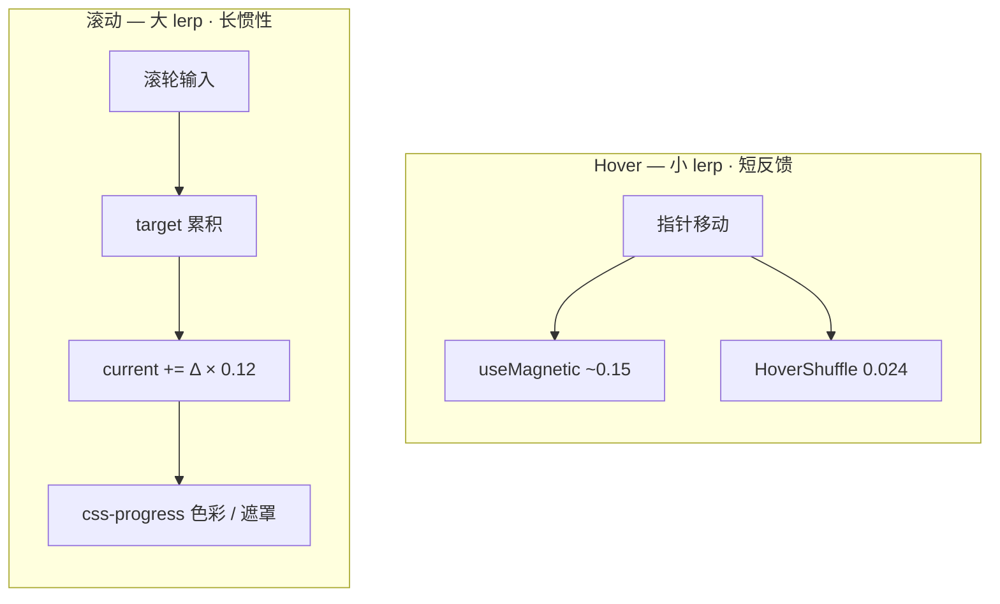

# 视觉风格与交互设计规范

| 字段     | 内容                                                                                        |
| -------- | ------------------------------------------------------------------------------------------- |
| 参考站点 | https://locomotive.ca/en                                                                    |
| 对标字体 | Editorial New + Helvetica Now → Cormorant Garamond + Inter                                  |
| 关联实现 | `HoverShuffleText` · `MagneticButton` · `useMouseParallax` · `createHoverShuffle`           |
| 关联文档 | [RESEARCH](./RESEARCH.md) · [COMPONENTS](./COMPONENTS.md) · [PERFORMANCE](./PERFORMANCE.md) |
| 更新日期 | 2026-06-25                                                                                  |

> 滚动与 css-progress 原理见 [RESEARCH.md §2](./RESEARCH.md#2-核心原理)。组件接入见 [COMPONENTS.md](./COMPONENTS.md)。

---

## 一、排版与空间

Locomotive 的高级感来自 **极端字号对比 + 衬线/无衬线混排 + 刻意留白**，而非装饰元素堆叠。

| 维度         | 原站手法                                     | 美学意图            | 本项目映射                                    |
| ------------ | -------------------------------------------- | ------------------- | --------------------------------------------- |
| Display 标题 | `clamp(6rem, 14vw, 12rem)` 级超大衬线        | 品牌即杂志封面      | `.type-mega` / `.type-section-mega`           |
| 正文/UI      | 11–13px，`letter-spacing: 0.2–0.28em` 全大写 | 工业精密感          | `font-body` + `tracking-widest uppercase`     |
| 行高         | Display `line-height: 0.88–0.92`             | 大字压得住画面      | `main.css` type scale                         |
| 负空间       | 区块 `padding-block: 8–12rem`                | 留白 = 奢侈         | `HomePhilosophySection` / `HomeAgencySection` |
| 网格         | 12 列响应式                                  | 暗场精选 + 留白节奏 | `HomeFeaturedRail`                            |

**家具 SPU 排版原则**

1. **一卡一主角** — 每张商品卡只有一个视觉焦点（主图）
2. **三级字号阶梯** — eyebrow（0.6875rem）→ 商品名（clamp 1.125–1.5rem）→ 价格（0.875rem `tabular-nums`）
3. **精选区升格** — 首页暗场网格内标题略大，前景色 `brand-50`
4. **行宽约束** — 叙事正文 `max-w-md`（~28rem）
5. **数字对齐** — 价格一律 `tabular-nums`，避免布局抖动

---

## 二、动效物理质感

原站「丝滑感」来自 **Lenis 帧间 lerp 插值**，而非 CSS `scroll-behavior: smooth`。



> 滚动与 Hover **不可共用同一 lerp 曲线**。原理详见 [RESEARCH §2.1](./RESEARCH.md#21-lenis-虚拟滚动与-lerp-插值)。

| 参数              | 原站典型值              | 感知效果       | 本项目                                        |
| ----------------- | ----------------------- | -------------- | --------------------------------------------- |
| `lerp`            | `0.1` ~ `0.12`          | 指数衰减追赶   | `LENIS_OPTIONS.lerp: 0.12`                    |
| `wheelMultiplier` | `0.9`                   | 降低滚轮灵敏度 | `scrollConstants.ts`                          |
| 自定义 easing     | `1 - 2^(-10t)`          | 尾段柔和着陆   | `--ease-brand: cubic-bezier(0.16, 1, 0.3, 1)` |
| ScrollTo duration | `1.2s`                  | 锚点有重量感   | `SCROLL_TO_DURATION`                          |
| GSAP 入场         | `expo.out`，`0.95–1.1s` | 快启慢停       | `animation.ts` `EASE_EXPO`                    |

**Hover 与磁性**

| 交互         | 原站逻辑                      | 本项目                          |
| ------------ | ----------------------------- | ------------------------------- |
| 链接字符跳动 | `stagger: 0.02–0.03`          | `HoverShuffleText` `0.024`      |
| 按钮磁性吸附 | 偏移 15–35%，非 1:1 跟踪      | `useMagnetic` `strength: 0.28`  |
| 卡片操作栏   | `translateY` 滑入，略晚于图片 | `product-card__actions` `0.55s` |
| 图片放大     | `scale(1.05)`，`1.2s`         | `main.css` hover                |

---

## 三、色彩叙事（css-progress）

原站区块切换时背景/前景色由 **滚动进度驱动的 CSS 渐变** 完成，而非硬切。

| 技法         | 实现                                      | 本项目                               |
| ------------ | ----------------------------------------- | ------------------------------------ |
| css-progress | `data-scroll-css-progress` → `--progress` | `ScrollSection` / `HomeDynastyStrip` |
| 文字扫光     | `background-clip: text` + progress 位移   | `.text-scrub-fill`                   |
| 区块过渡     | sticky 容器 background 插值               | `HomeHeroSection`                    |
| 行遮罩揭示   | `translateY(110%)` × `--line-delay`       | `[data-mask-line]`                   |

```css
/* progress 0→1：brand-50 → brand-900 */
.section-blend {
  background: color-mix(
    in oklab,
    var(--color-brand-50) calc((1 - var(--progress, 0)) * 100%),
    var(--color-brand-900)
  );
}
```

叙事 scrub 段可叠加 `scale(1 + progress × 0.08)` + `clip-path` 底部揭示。

---

## 四、微交互

| 触点              | 参数要点                                          | 组件                            |
| ----------------- | ------------------------------------------------- | ------------------------------- |
| 导航链接          | `y: ±(8–14px)`，`stagger: 0.024`，`0.4s expo.out` | `HoverShuffleText`              |
| 全局 CTA          | `strength: 0.28`，`maxOffset: 12px`               | `MagneticButton`                |
| Featured 卡片     | 副图 `opacity 0.65s` + 文字 shuffle               | `ProductCardMedia`              |
| 购物车角标        | `0.65s` 弹性 pop                                  | `AppHeader` `.cart-badge--bump` |
| View Product 箭头 | `translate(5px, -3px)`                            | `.product-card__view-arrow`     |

**HoverShuffle 标准值**

| 属性       | Enter             | Leave      |
| ---------- | ----------------- | ---------- |
| `y`        | `random(-14, -6)` | `0`        |
| `rotateX`  | `random(-12, 8)`  | `0`        |
| `duration` | `0.42s`           | `0.55s`    |
| `stagger`  | `0.024`           | `0.018`    |
| `ease`     | `expo.out`        | `expo.out` |

---

## 五、商品卡规范

| 属性                 | 值                                              |
| -------------------- | ----------------------------------------------- |
| 图片 hover scale     | `1.05`                                          |
| 视差 `maxX` / `maxY` | `10px` / `8px`                                  |
| 视差 lerp            | `0.1`                                           |
| 副图交叉淡入         | `0.65s ease-brand`                              |
| 操作栏滑入           | `0.55s ease-brand`                              |
| 色板浮现             | `0.45s`，`translateY(8px)→0`；仅 `hover: hover` |

### 降级矩阵

| 条件                     | 影响                       |
| ------------------------ | -------------------------- |
| `prefers-reduced-motion` | 关闭 shuffle / 磁性 / 视差 |
| `tier === 'reduced'`     | 视差减半；shuffle 仅 Y 轴  |
| `animations === false`   | 全部微交互静态化           |
| `@media (hover: none)`   | 操作栏常显；无视差         |

运行时 jank 降级见 [PERFORMANCE.md](./PERFORMANCE.md#3-降级策略)。

---

## 六、组件入口

| 组件 / Composable    | 路径                                     |
| -------------------- | ---------------------------------------- |
| `MagneticButton`     | `components/ui/MagneticButton.vue`       |
| `HoverShuffleText`   | `components/scroll/HoverShuffleText.vue` |
| `useMouseParallax`   | `composables/useMouseParallax.ts`        |
| `useMagnetic`        | `composables/useMagnetic.ts`             |
| `createHoverShuffle` | `lib/scroll/animation.ts`                |

```vue
<MagneticButton :to="localizedPath('/products')" size="lg">
  {{ t('home.cta.button') }}
</MagneticButton>

<HoverShuffleText :text="link.label" tag="span" />
```

完整 API 见 [COMPONENTS.md](./COMPONENTS.md)。

---

## 七、验收与调试

本地启动：`npm run dev` → http://localhost:3000。环境配置见 [DEPLOYMENT](./DEPLOYMENT.md)。

| 验证点       | 路径                                        | 操作                        |
| ------------ | ------------------------------------------- | --------------------------- |
| 磁性 CTA     | `/about` 底部                               | 慢移鼠标观察吸附与回弹      |
| 导航 shuffle | 顶栏链接                                    | hover「Collection / About」 |
| 商品视差     | `/products` 或首页 Featured                 | hover 商品主图              |
| 色彩 scrub   | 首页 Dynasty 条                             | 慢滚观察标题扫光            |
| 降级         | DevTools → `prefers-reduced-motion: reduce` | 刷新后微交互静态化          |

**参数文件**：`scrollConstants.ts` · `main.css` · `animation.ts` · `useMagnetic.ts` · `useMouseParallax.ts`

```bash
npm run check        # lint + typecheck + test
npm run check:perf   # 包体积预算
```

---

## 八、与原站的刻意差异

| 维度               | Locomotive.ca      | 本项目                        | 原因                                |
| ------------------ | ------------------ | ----------------------------- | ----------------------------------- |
| 字体               | 定制 LocomotiveNew | Cormorant + Inter             | 授权与加载成本                      |
| 3D 团队场景        | About 页 InView    | `/about` 已集成 `TeamScene3D` | 电商转化优先，非首页                |
| 全站 hover shuffle | 所有链接           | 导航 + 关键 CTA               | 性能与可读性                        |
| 视差               | 少用 speed 视差    | css-progress + 鼠标微动       | 对齐 [RESEARCH](./RESEARCH.md) 结论 |

---

## 结论

Locomotive 高级感 = **极端排版 + 大面积留白 + Lenis 惯性 + css-progress 色彩叙事 + 少量 GSAP 点缀**。

首页完整复刻上述语言；商品列表/详情仅保留卡片视差与必要 hover，确保 10 SPU 电商路径不被动效打断。

---

## 下一步阅读

- 组件 API 与接入方式 → [COMPONENTS](./COMPONENTS.md)
- 性能降级与 jankGuard → [PERFORMANCE](./PERFORMANCE.md)
- 本地验收操作步骤 → [DEPLOYMENT §2](./DEPLOYMENT.md#2-本地开发)
